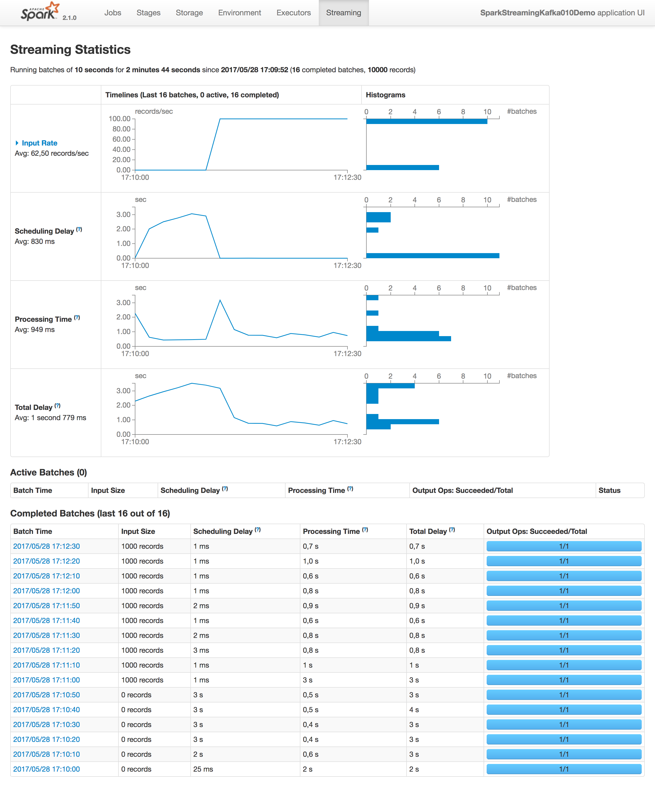

# Spark Streaming + Kafka 0.10 Demo

This demo and [those slides](https://www.slideshare.net/JoanViladrosaRiera/spark-streaming-kafka-010) were used in [Spark Barcelona Meetup](https://www.meetup.com/es-ES/Spark-Barcelona/events/240088002/). I hope all of you found it interesting, and I would like to share it to improve our community :) 

The purpose was to show a brief history of spark streaming + kafka evolution over the time and some code to make it run. Here is a little demo on how to connect to kafka from Spark Streaming, do some transformations (actually a word count splitting lines), and outputting  data to a local directory.

Feel free to use it wherever you want, or for whatever purpose, just let me know because I'd love to hear about your work :)

## Running Local Kafka Cluster
To run the demo, you will need a local kafka cluster, with a broker listening on `localhost:9092`. A docker-compose config file is provided, to run a single broker kafka cluster + single node zookeeper.

To start it:
```
$ docker-compose -f kafka-docker/docker-compose.yml up -d
```

And to shut it down:
```
docker-compose -f kafka-docker/docker-compose.yml down
```
The ports are `2181` for ZooKeeper and `9092` for Kafka

Obiously you can run your own local kafka cluster to run the demo, but make sure the version is >= `0.10` (as is needed for the new spark streaming integration), and the advertised hostname is `127.0.0.1`, or just do it the docker-way because it's cooler ;)


## Generating records to the topic
To send records to text topic (the one the demo is subsribed to), you can use kafka-console-producer.sh in the kafka broker docker instance.

```
$ docker exec -i kafkadocker_kafka_1 /opt/kafka/bin/kafka-console-producer.sh \
            --broker-list 127.0.0.1:9092 --topic text < input/shakespeare.txt 
```


## Running the Demo

Once the kafka cluster + zookeeper is up and running, you can start the demo with your IDE of choice importing the maven `pom.xml`, or you can build it from shell with maven and launch the generated jar (it's a shaded fat jar including all the dependencies)

```
$ mvn clean package
$ java -jar target/spark-streaming-kafka-0-10-demo.jar
```

You can access the `Spark UI` with a web broswer at `http://localhost:4040`. 

Probably the most interesting tab is the `Streaming` one, but feel free to look at the `Stages` scheduled and other info around.



## About the code

You can tune how fast your streaming app ingest data with `spark.streaming.kafka.maxRatePerPartition` property defined in the `SparkConf` object. If you are using the docker approach to create a local kafka cluster, take into consideration that there are 4 partitions in the `text` topic.

Also, take a look at `auto.offset.reset` and `enable.auto.commit`, to tune if commiting offsets automatically to kafka, or where to start on the topic when starting for the first time.


## About 

If you found this talk/demo interesting, and love new challenges involving Big Data, I would really like to meet you!


At [Billy Mobile](http://billymob.com) we are always looking for talented people who want to join our fantastic team of developers, data scientists and other fantastic creatures ;-) 

If you are interested, contact me on twitter [@joanvr](http://www.twitter.com/@joanvr), [linkedIn](https://www.linkedin.com/in/joanviladrosa), or via email [joan.viladrosa@billymob.com](mailto:joan.viladrosa@billymob.com)

